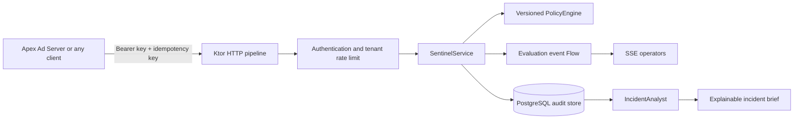

# Apex Sentinel

A production-shaped Ktor 3 service for explainable, multi-tenant traffic decisions. Apex Ad Server—or any HTTP backend—can send a compact risk observation and receive an `ACCEPT`, `REVIEW`, or `BLOCK` decision with the exact policy rules that matched.

This is deliberately a **control plane**, not a replacement for Apex's Go auction hot path. Go keeps doing latency-sensitive auction fan-out; Sentinel owns versioned policy, durable audit history, incident briefs, and live operational streams.

## What this adds or resolves?

- Real backend concerns: authentication, tenant isolation, validation, idempotency, safe errors, rate limits, health/readiness, metrics, migrations, and structured logs.
- Kotlin strengths: immutable domain models, sealed-ish enum vocabulary, null safety, collection DSLs, coroutines, and `Flow`/SSE.
- Ktor strengths: only the plugins the service needs, explicit wiring, test-host API tests, and a reusable custom plugin in `ktor-guardrails`.
- Honest production boundaries: PostgreSQL is mandatory in production; local memory mode is for learning and tests; cross-replica rate limiting and streaming are documented extension points.
- Explainable automation: incident briefs are deterministic and auditable. An LLM can be added behind `IncidentAnalyst`, but AI never decides whether traffic is blocked.

## Architecture



The dependencies point inward: routes depend on application services, application services depend on ports, and infrastructure implements those ports. Domain policy code has no Ktor or database dependency.

## Run it in 60 seconds

You need JDK 21.

```bash
./gradlew test
./gradlew :app:run
```

Then, in another terminal:

```bash
curl -i http://localhost:8080/v1/evaluations \
  -H 'Authorization: Bearer dev-apex-key' \
  -H 'Idempotency-Key: portfolio-demo-1' \
  -H 'Content-Type: application/json' \
  --data @http/evaluation.json
```

The default request is blocked because it combines an untrusted tier with a burst. Repeat the same request and key: the service returns the original decision with `replayed: true`. Reuse that key with a different body and it returns `409 Conflict`.

Useful endpoints:

| Endpoint | Purpose |
|---|---|
| `GET /health/live` | Process liveness |
| `GET /health/ready` | Storage readiness |
| `GET /metrics` | Prometheus text metrics |
| `GET /docs/openapi.yaml` | OpenAPI 3.1 contract |
| `POST /v1/evaluations` | Evaluate traffic |
| `GET /v1/evaluations/{id}` | Read the tenant-scoped audit record |
| `GET /v1/evaluations/stream` | Live Server-Sent Events |
| `GET /v1/incidents/brief` | Create a deterministic incident brief |
| `POST /v1/admin/tenants/{tenant}/policies/validate` | Validate a policy without activating it |
| `POST /v1/admin/tenants/{tenant}/policies` | Activate a newer policy version |

## Run with PostgreSQL

```bash
docker compose up --build
```

The Compose profile is for local development. For production, set `SENTINEL_ENV=production`, use long random secrets, terminate TLS at a trusted ingress, and provide a managed PostgreSQL URL.

Configuration is entirely environment-driven; see [.env.example](.env.example). Production startup fails closed if memory storage or development keys are selected.

## Repository map

```text
app/
  domain/          pure policy model and engine
  application/     use cases and ports
  infrastructure/  in-memory and PostgreSQL adapters, metrics, event flow
  api/             Ktor routes and HTTP error mapping
ktor-guardrails/    reusable per-tenant token-bucket Ktor plugin
docs/               architecture, integration, operations, and learning guide
http/               ready-to-send sample request
```

## Verification

```bash
./gradlew check
./gradlew :app:buildFatJar
```

The tests cover policy scoring, threshold validation, tenant isolation, authentication, API behavior, idempotent replay, payload conflicts, and bucket isolation.

Start with [the beginner learning guide](docs/LEARNING_GUIDE.md), then read [the architecture decisions](docs/ARCHITECTURE_DECISIONS.md) and [the Apex integration guide](docs/APEX_INTEGRATION.md).

For a production-oriented explanation of every technology, the capability it provides, and its operational trade-offs, read [the complete technology stack](docs/TECH_STACK.md). The [verification record](docs/VERIFICATION.md) separates what has actually been exercised from future production work.

Licensed under the [MIT License](LICENSE).
