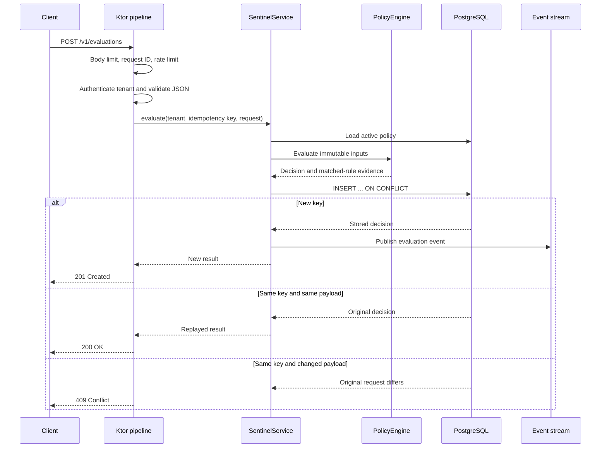
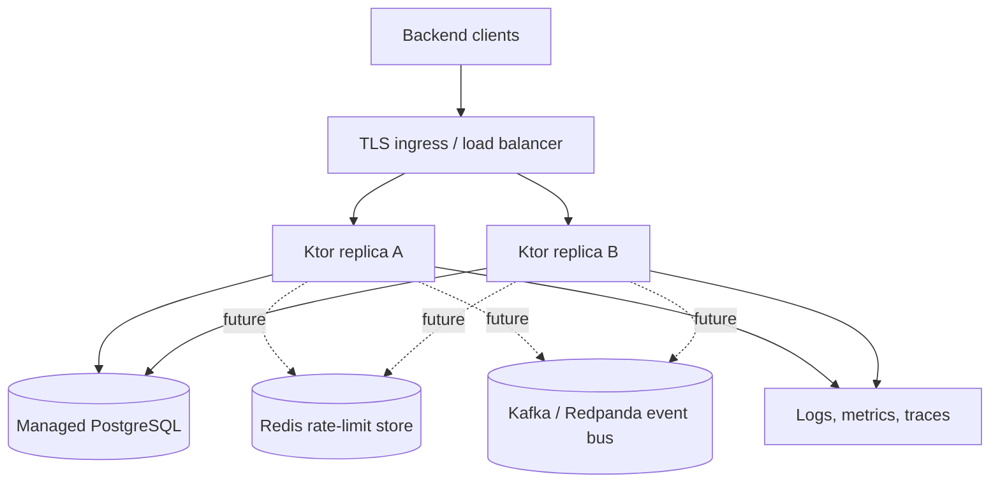

# Production technology stack

This document explains not only what Apex Sentinel uses, but what each choice accomplishes in the running system. Versions are pinned in Gradle or the container definition so builds remain reproducible.

## Capability map

| Production capability | Technology | What it accomplishes |
|---|---|---|
| Type-safe domain model | Kotlin 2.4.20 | Models policies and decisions as immutable values, makes absence explicit, and removes common null-related failures. |
| HTTP application runtime | Ktor 3.6.0 with Netty | Supplies an asynchronous HTTP pipeline without imposing a large application framework or classpath-scanning model. |
| Structured concurrency | Kotlin coroutines 1.11.0 | Gives every request cancellable asynchronous work with lifecycle propagation instead of unmanaged futures or callbacks. |
| Live operator stream | Kotlin `Flow` and Ktor SSE | Pushes one-way evaluation updates to operators while automatically cancelling collection when clients disconnect. |
| API contracts | Kotlinx Serialization 1.11.0 and OpenAPI 3.1 | Converts typed request/response values to strict JSON and provides a language-neutral contract for consumers. |
| Durable system of record | PostgreSQL 17 | Persists policy versions, decision evidence, and idempotency state transactionally. |
| Schema lifecycle | Flyway 13.7.0 | Validates and applies ordered database migrations before the server accepts traffic. |
| Database connectivity | PostgreSQL JDBC 42.7.8 and HikariCP 7.0.2 | Provides a mature driver and a bounded connection pool with timeouts and leak detection. |
| Abuse protection | Reusable `ktor-guardrails` token bucket | Applies tenant-aware burst and sustained request limits with standard `429` and `Retry-After` responses. |
| Service identity | Ktor bearer authentication | Maps runtime-injected API credentials to a tenant principal; all data access remains tenant-scoped. |
| Request safety | Request Validation and Request Body Limit | Rejects invalid domain values and caps request bodies at 64 KiB before they can consume unbounded resources. |
| Failure contract | Ktor Status Pages | Converts known failures into stable status codes and JSON envelopes without leaking stack traces. |
| Correlation | Ktor Call ID and JSON Logback | Propagates `X-Request-ID` into responses and structured logs for end-to-end investigation. |
| Health and telemetry | Liveness, readiness, and Prometheus text metrics | Separates process health from dependency readiness and exposes low-cardinality decision counters. |
| Packaging | Gradle 8.14.4 and Ktor fat JAR | Produces one executable JVM artifact with a pinned wrapper so local and CI builds use the same toolchain. |
| Runtime isolation | Multi-stage Docker image | Compiles in a JDK image and runs as a non-root user in a smaller JRE image. |
| Local environment | Docker Desktop and Compose | Reproduces the application/PostgreSQL topology without requiring a host database installation. |
| Continuous verification | GitHub Actions | Runs tests and creates the executable artifact for every pull request and main-branch push. |

## Runtime request pipeline



The database uniqueness constraint on `(tenant_id, idempotency_key)` is the concurrency authority. An in-memory pre-check would be insufficient because separate instances can race.

## Application architecture

Sentinel uses ports and adapters:

```text
api -> application -> domain
          ^             |
          |             |
     infrastructure ----+
```

- **Domain:** pure policies and decisions. It does not import Ktor, SQL, or serialization infrastructure beyond its DTO annotations.
- **Application:** use cases and interfaces such as `SentinelStore`, `EvaluationEvents`, and `IncidentAnalyst`.
- **Infrastructure:** PostgreSQL, HikariCP, Flyway, metrics, and the in-process event stream.
- **API:** authentication, routing, HTTP validation, status codes, SSE, and error representation.

This direction keeps business rules independently testable and lets infrastructure change without rewriting policy logic.

## Kotlin, Ktor, and Netty

### Kotlin 2.4.20

Kotlin gives the service concise immutable data types, exhaustive enums, null safety, extension functions, and first-class coroutine support. The main benefit is not fewer characters; it is making invalid states more visible during compilation and review.

### Ktor 3.6.0

Ktor is the composition layer. Only required plugins are installed:

- `Authentication` establishes the tenant or administrator.
- `ContentNegotiation` binds strict JSON to typed Kotlin values.
- `RequestValidation` enforces domain boundaries after decoding.
- `RequestBodyLimit` protects memory and parsing work before a handler executes.
- `CallId` and `CallLogging` create traceable structured operations.
- `StatusPages` owns the public failure contract.
- `Compression` reduces ordinary response size; SSE is intentionally not compressed by Ktor.
- `CORS` is permissive only outside production.
- `SSE` exposes the live evaluation stream.

Ktor does not discover components automatically. `Application.module()` is the explicit composition root, so service startup and test substitutions are easy to follow.

### Netty

Netty is the HTTP engine underneath Ktor. It provides proven event-loop networking and backpressure-aware primitives. Application code should never block those event loops; JDBC operations therefore run on `Dispatchers.IO`.

## Data stack

### PostgreSQL 17

PostgreSQL supplies the guarantees that matter most here:

- a unique constraint makes idempotency correct under concurrency;
- transactions activate one policy version atomically;
- a partial unique index enforces one active policy per tenant;
- indexed decision/time columns support incident queries;
- durable rows provide an auditable explanation of every decision.

Production requires PostgreSQL. The in-memory adapter exists only for fast tests and local learning, and startup rejects it when `SENTINEL_ENV=production`.

### Explicit JDBC and SQL

The schema is small and concurrency behavior is central, so explicit SQL is clearer than an ORM. Every blocking call is wrapped in `withContext(Dispatchers.IO)`. This is a deliberate compromise: JDBC is mature and predictable, while fully reactive drivers add complexity that should be justified by measured database-wait pressure.

### HikariCP

The pool bounds concurrent database pressure instead of opening a connection per request. Sentinel sets connection and validation timeouts, a maximum size, minimum idle connections, and leak detection. These values are starting points; production sizing must use load tests and the database connection budget.

### Flyway

Flyway runs before the server starts accepting traffic. It validates migration history and applies pending scripts in order. A failed migration prevents startup, which is safer than serving against an incompatible schema.

For larger deployments, move migrations into a single pre-deployment job so several application replicas do not all attempt startup migration simultaneously.

## Security stack and trust boundaries

Bearer API keys are adequate for a portfolio and an internal first deployment, but they are not presented as the final identity architecture. Production evolution should use workload identity or OAuth2 client credentials, a secret manager, automated rotation, and TLS everywhere.

Implemented protections include:

- constant-time credential comparison;
- tenant identity derived from credentials rather than a client-selected tenant header;
- tenant predicates on every stored-data operation;
- separate administrative credentials;
- strict production configuration checks;
- request body and field limits;
- bounded rate-limit state;
- no raw credentials in logs or database rows;
- generic `500` responses with internal error details confined to logs;
- non-root container execution.

`subjectId` must already be pseudonymous. Callers must not send raw advertising IDs, IP addresses, Play Integrity tokens, private keys, or Apex lease secrets.

## Idempotency and consistency

Clients are expected to retry. The API binds an idempotency key to a complete request:

- a first submission creates the audit record;
- an identical retry returns the original result;
- a changed payload under the same key is rejected;
- an event is published only for the transaction that first stores the result.

The current event publication happens immediately after the database write. If downstream delivery must survive a process crash between commit and publish, add a transactional outbox table and a background publisher.

## Observability

The project intentionally starts with low-cardinality telemetry:

- JSON application logs;
- request IDs in logs and responses;
- process liveness and database readiness endpoints;
- decision totals by bounded decision enum;
- idempotency replay totals;
- database pool diagnostics through library logs.

Production should add OpenTelemetry traces and histograms for request latency, policy evaluation, and database operations. Never place tenant IDs, subject IDs, event IDs, or unbounded error messages into metric labels.

Suggested initial service-level objectives, to be validated with real traffic:

| Objective | Starting target |
|---|---|
| Availability | 99.9% successful eligible requests per rolling 30 days |
| Evaluation latency | p95 under 50 ms within the deployment region |
| Error rate | Under 0.1% server errors, excluding rejected client traffic |
| Durability | No acknowledged evaluation lost after PostgreSQL commit |

These are design targets, not measured production claims.

## Deployment topology



The included token bucket and `SharedFlow` are process-local. One replica is fully functional. At multiple replicas:

- use Redis if limits must be global rather than per replica;
- use Kafka, Redpanda, or a PostgreSQL-backed outbox if every event must be durable and visible across nodes;
- keep PostgreSQL as the decision source of truth;
- make policy reads cacheable with explicit version invalidation.

## Build and delivery

The checked-in Gradle wrapper fixes the build tool version. GitHub Actions uses Java 21, runs `check`, and creates the executable fat JAR. The multi-stage Dockerfile leaves build tools out of the runtime image and runs the process as UID `10001`.

Recommended production delivery additions:

1. generate an SBOM and sign the image;
2. scan dependencies and the final image;
3. pin base images by digest through an automated update process;
4. publish immutable image tags containing the Git SHA;
5. promote the same artifact between environments;
6. run migrations as a controlled deployment step;
7. use canary rollout and automatic rollback on SLO regression.

## Why not Spring Boot or Go for this component?

Ktor is a strong fit for a Kotlin-heavy control plane: rich domain types, coroutine composition, direct access to the JVM ecosystem, and a small explicit framework surface. Spring Boot would add a broader enterprise ecosystem and more conventions, but also more indirection and auto-configuration than this service needs.

Go remains the right fit for Apex Ad Server's extremely lean auction data path. Its simple deployment and low memory footprint are excellent there. Sentinel's policy modeling, streaming, and evolving orchestration benefit more from Kotlin's expressiveness. The two services are complementary rather than a rewrite exercise.

## Upgrade policy

- Patch releases: renovate monthly and run the full verification suite.
- Kotlin/Ktor minor releases: review migration notes, update together where compatibility requires, and rerun API plus PostgreSQL tests.
- PostgreSQL major releases: validate through a restored production-sized backup before rollout.
- Base images: rebuild regularly even when application source does not change.
- Breaking API changes: publish a new path or media-type version and maintain an explicit deprecation window.

Current version choices were checked against the official [Ktor release documentation](https://ktor.io/docs/releases.html), [Kotlin release documentation](https://kotlinlang.org/docs/releases.html), and [Exposed/JVM ecosystem guidance](https://www.jetbrains.com/help/exposed/adding-dependencies.html), though this service intentionally uses explicit JDBC rather than Exposed.
